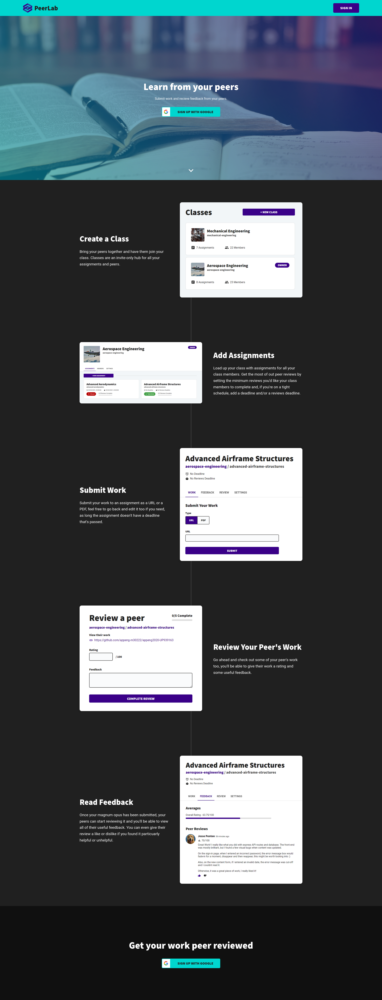

# PeerLab

> University Second Year Coursework Assignment

A web application that allows students to share their work for peer review and
receive feedback from their peers.


## Docker
The web app can be run with Docker using:
```
docker compose up -d
```

Once running, head to [http://localhost:8080](http://localhost:8080).

The app will run in demo mode, which will apply some example data to the first
account created, allowing you to immediately test out it's features.

By default, the docker configuration will automatically copy [config-default.js](config-default.js)
to use as the config. You are free to create and configure your own `config.js`
file from [config-default.js](config-default.js) and it will be used instead.
However, you may need to rebuild your image  by applying the `--build` flag if
you have already run `docker compose up -d`.


## Manual Installation
### Dependencies
Required dependencies that must be installed for the web app to run:

- PostgreSQL v11 or higher
- NodeJS v14 or higher
- npm v7.6 or higher

Running `npm install` will install all remaining dependencies.

#### Optional
- Graphviz: Needed for Madge and therefore needed to run `npm run docs:madge`
and `npm run docs`.


### Setup
To setup PeerLab's database run:
```
npm run setup
```

After which, create a `config.js` file using [config-default.js](config-default.js)
as a template, replacing any values if needed.


### Usage
The web app can be run with:
```
npm start
```

Once running, it will be reachable at [http://localhost:8080](http://localhost:8080).

It is recommended you use demo mode.


### Demo Mode
Example data is provided and can be used by running the web app in demo mode.
Demo mode will apply the example data to the first account created, allowing you
allowing you immediately test out Peerlab's features.

To use demo mode, run:
```
npm run demo
```

Demo mode disables the implemented Google Cloud API authentication. Google's
authentication requires test users to be manually added in the Cloud console in
order for them to use the authentication, which is not feasible in this case.
Instead, demo mode prompts you for your name and email when you sign up to
register your account. After this, you can simply just enter your email to log
in, the name fields will have no effect once you've created your account.


## API Reference
API reference documentation can be found at
[http://localhost:8080/api-docs](http://localhost:8080/api-docs) when the web
application is running.


## Requirements Specification
The original requirements for the web app can be found in
[docs/requirements.md](docs/requirements.md).


## Design Documentation
Design documentation including an entity relationship diagram, system
architecture diagram, and module dependency diagram, can be found in
[docs/design.md](docs/design.md).


## Code Documentation
Code documentation can be found in [doc/client/](doc/client/) for code in
[public/](public) and [doc/server/](doc/server/) for code in [src/](src).


## Landing Page

