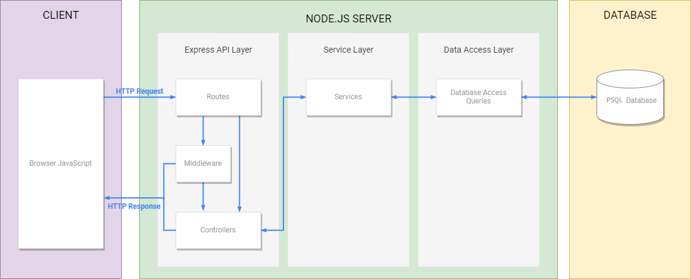
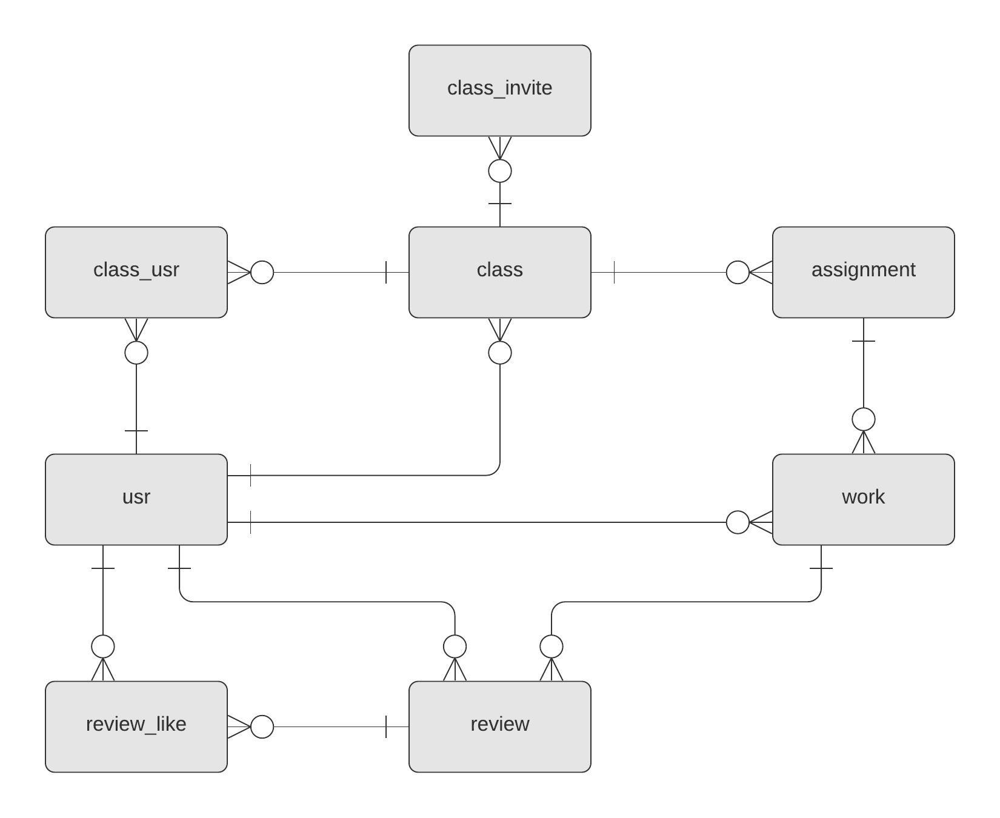
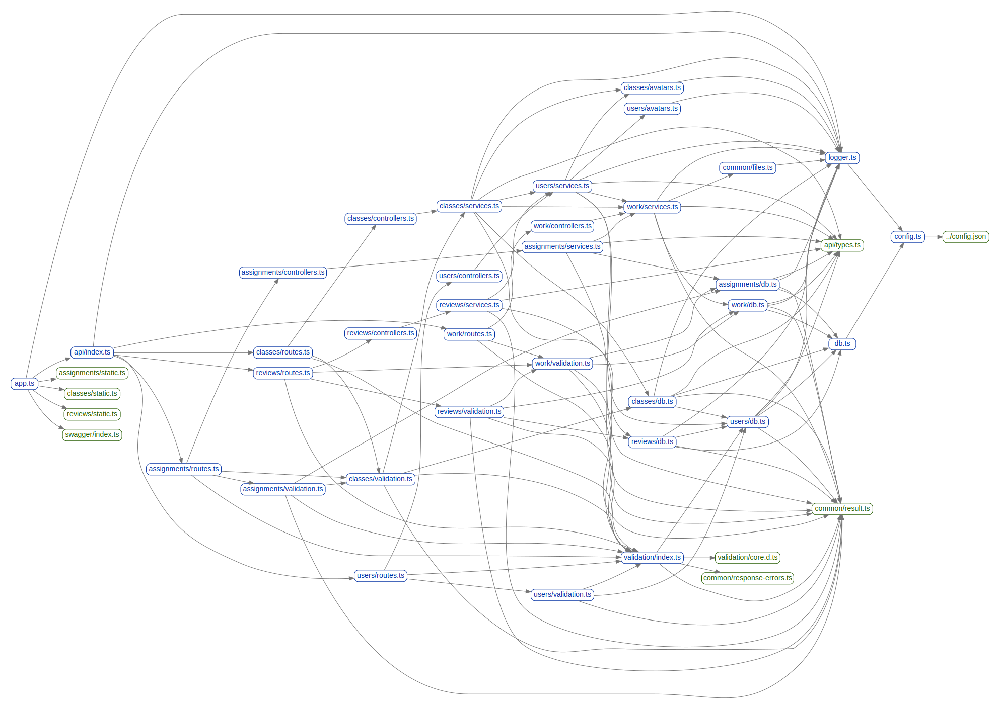

# PeerLab Documentation

## Setup and Launch
For setup instructions, required dependencies with recommended versions and mock
data instructions, see [setup.md](setup.md).

To launch PeerLab, run `npm start` and it will be reachable via HTTP on port 8080.

## Requirements Specification
PeerLab's requirements specification can be found in [requirements.md](requirements.md).

## System Architecture

More information on the system architecture, including the project's file structure, can be found in [architecture.md](architecture.md).

## Design
PeerLab's brand style guide and UI mockup can be found at [brand-style-guide.pdf](brand-style-guide.pdf) and [ui-mockup.pdf](ui-mockup.pdf). 

## Database ERD

## Module Diagram

## API Reference
PeerLab's API Reference can be found at /api-docs when PeerLab is launched.

## Code Documentation
Code documentation for the client-side can be found at [client/index.html](client/index.html) and for the server-side at [server/index.html](server/index.html).
