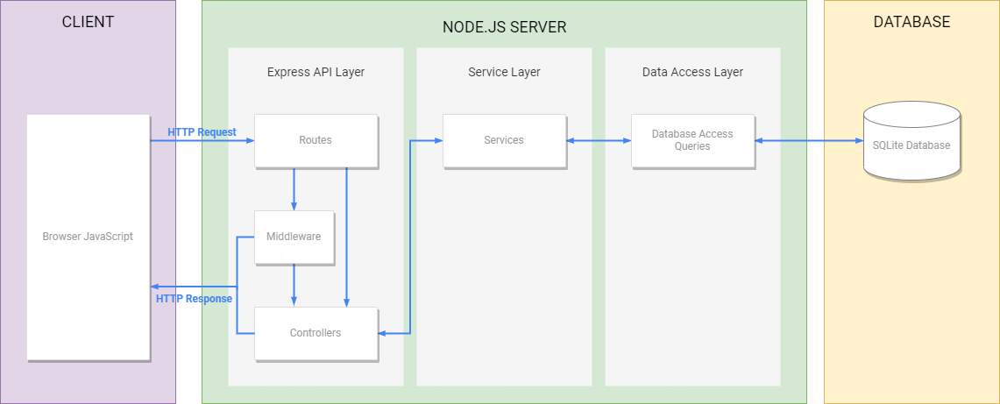

# Software Architecture
Architecture design dictating the layers, components and file structure of the web application.


## Architecture

- Express API Layer - Contains all the API routes, middleware and controllers
- Service Layer - Contains all the business logic
- Data Access Layer - Contains all database interactions


## File Structure
Folder-by-feature
```
.
|-- config                  # Environment variables
|-- db                      # Database initialisation
    |-- migrations
    |-- index.js
|-- feature
    |-- controllers         # Controllers for route logic
    |-- services            # Business logic
    |-- tests               # Unit Tests
    |-- data-access.js      # Data access - Parameterized queries
    |-- route.js            # Express API routes
|-- middleware              # Middleware for authentication, validation, etc.
|-- public                  # Static content
    |-- assets
        |-- img
    |-- css
    |-- js
    |-- user-content        # User content for work pdfs, profile imgs, etc.
|-- utils                   # Common logic functions
|-- server.js               # Server entry point
```