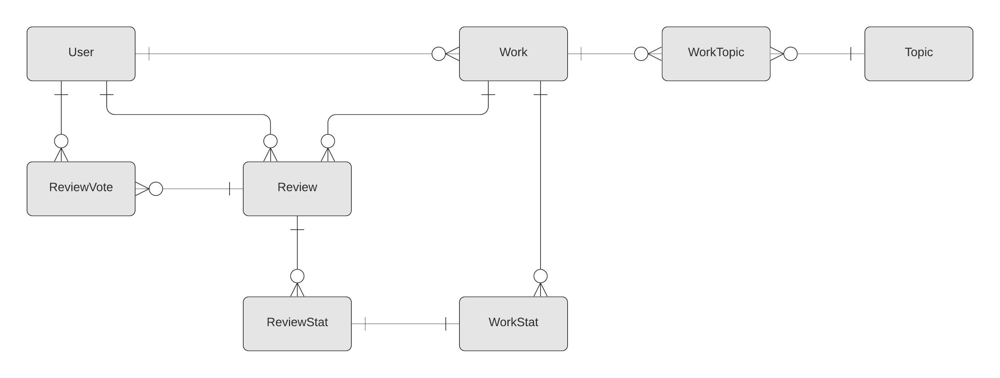

# Data

## Entity Relationship Diagram

## Data Dictionary
### User
| PK | userID    | INTEGER | AUTOINCREMENT                       |
| :- | :-------- | :------ | :---------------------------------- |
|    | username  | TEXT    | NOT NULL UNIQUE                     |
|    | email     | TEXT    | NOT NULL UNIQUE                     |
|    | password  | TEXT    | NOT NULL                            |
|    | salt      | TEXT    | NOT NULL                            |
|    | fname     | TEXT    | NULL                                |
|    | lname     | TEXT    | NULL                                |
|    | imgFormat | TEXT    | NULL                                |
|    | joinTime  | TEXT    | NOT NULL DEFAULT CURRENT\_TIMESTAMP |

### Work
| PK | workID      | INTEGER | AUTOINCREMENT                       |
| :- | :---------- | :------ | :---------------------------------- |
| FK | userID      | INTEGER | NOT NULL                            |
|    | uuid        | TEXT    | NOT NULL UNIQUE                     |
|    | name        | TEXT    | NOT NULL                            |
|    | description | TEXT    | NULL                                |
|    | isUrl       | BOOLEAN | NOT NULL                            |
|    | url         | TEXT    | NULL                                |
|    | uploadTime  | TEXT    | NOT NULL DEFAULT CURRENT\_TIMESTAMP |
|    | editTime    | TEXT    | NULL                                |

### WorkStat
| PK/FK  | workID       | INTEGER  |      |
| :----- | :----------- | :------- | :--- |
| __PK__ | __statName__ | __TEXT__ |      |
|        | description  | TEXT     | NULL |

### Topic
| PK | topic       | TEXT |      |
| :- | :---------- | :--- | :--- |
|    | description | TEXT | NULL |
|    | img         | TEXT | NULL |

### WorkTopic
| PK/FK     | workID     | INTEGER     |    |
| :-------- | :--------- | :---------- | :- |
| __PK/FK__ | __topic__  | __TEXT__    |    |

### Review
| PK/FK     | userID     | INTEGER     |                                     |
| --------- | ---------- | ----------- | ----------------------------------- |
| __PK/FK__ | __workID__ | __INTEGER__ |                                     |
|           | rating     | INTEGER     | NOT NULL                            |
|           | feeback    | TEXT        | NOT NULL                            |
|           | createTime | TEXT        | NOT NULL DEFAULT CURRENT\_TIMESTAMP |
|           | editTime   | TEXT        | NULL                                |

### ReviewStat
| PK/FK     | userID       | INTEGER     |          |
| :-------- | :----------- | :---------- | :------- |
| __PK/FK__ | __workID__   | __INTEGER__ |          |
| __PK/FK__ | __statName__ | __TEXT__    |          |
|           | rating       | INTEGER     | NOT NULL |

### ReviewVote
| PK/FK     | userID       | INTEGER     |          |
| :-------- | :----------- | :---------- | :------- |
| __PK/FK__ | __authorID__ | __INTEGER__ |          |
| __PK/FK__ | __workID__   | __INTEGER__ |          |
|           | isUpvote     | BOOLEAN     | NOT NULL |
